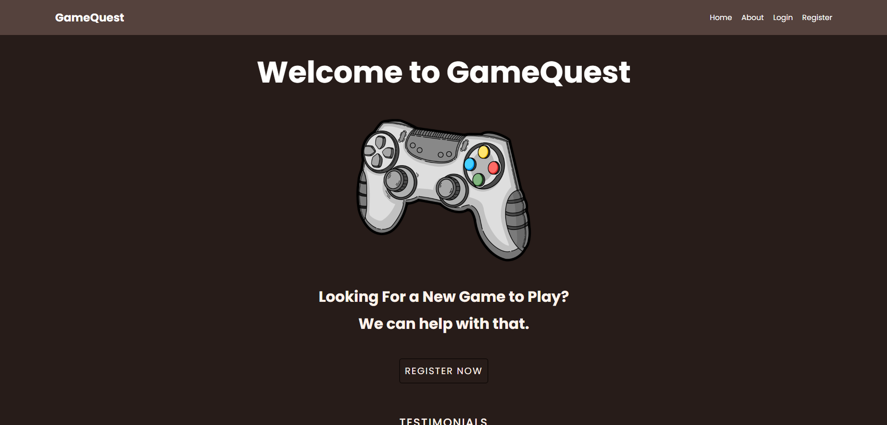
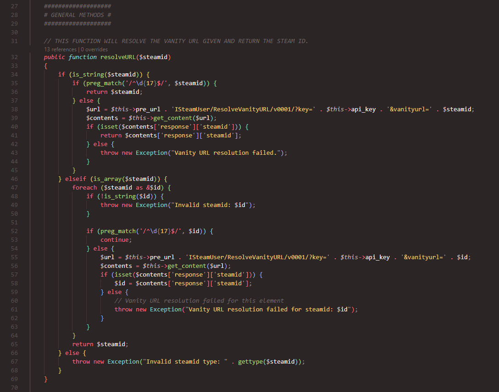
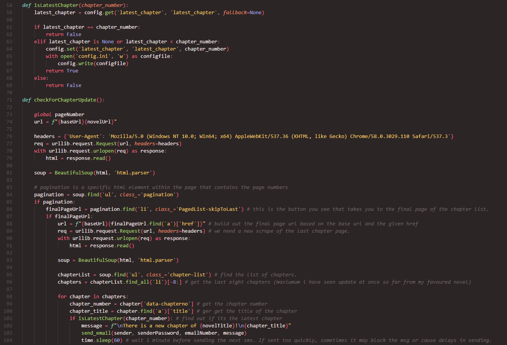

<h1 align="center">Hey👋 My name is Jason</h1>

###

  

###

  

###

<h3 align="left">👩‍💻  About Me</h3>

###

I'm from Canada, currently residing in Ottawa, ON.  - 🔭 I’m working as student at Algonquin College - 📚 I'm currently learning about various topics in the industry. I particularly enjoy backend web development. - ⚡ In my free time I like to work on personal projects, read, or play games. - ✏️ If you need to, you can contact me at jasonmueller.business@gmail.com

###

<h3 align="left">🛠 Language and tools</h3>

###

  
  
  
  
  
  
  
  
  
  
  
  
  
  
  
  
  

###

  
  
  
  
  
  
  
  
  

###

<h3 align="left">🔥   My Stats :</h3>

###

  
  

###

<h3 align="left">📦️   Projects :</h3>

###

<strong> - Game Quest</strong> A game recommendation application built to connect with your steam account to provide you with sufficient response based on your recent activity.

###

  

###

<strong> - Steam API</strong> A Steam API wrapper built in PHP. Forked from [github profile], it is heavily modified and updated for use in 2024, allowing for consistent and expected results.

###

  

###

<strong> - Novel SMS Script </strong> Written in Python, this small script is designed to work with webnovelworld in order to send users sms messages upon the release of new chapters of their favourite novels.

###

  

###
